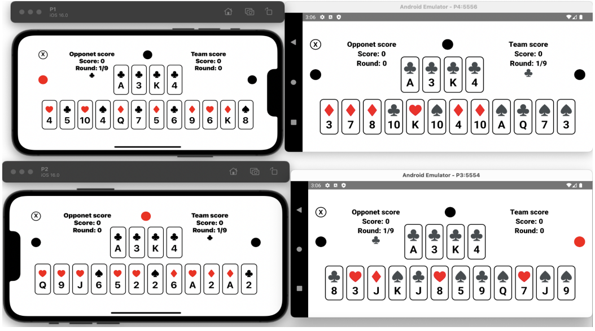

# Wist - Online Mobile Multiplayer Card Game  
[](https://reactnative.dev/)  
[](https://firebase.google.com/)  

A serverless, cross-platform multiplayer card game for playing **Wist** with friends online.  

---

Wist is an online multiplayer card game app that lets four players enjoy the popular card game "Wist" together virtually, without the need for a physical deck. The app is built using Google Firebase for real-time updates and React Native to work on both Android and iOS. This project provides a simple and fun way for card game lovers to play anytime, anywhere, while staying connected.

---




---

## 🎯 Features  
- 🃏 **Real-time multiplayer gameplay** for 4 players  
- 🔄 **Serverless architecture** with Firebase Realtime Database  
- 📱 **Cross-platform support** (Android & iOS)  
- 🎮 **Intuitive UI**

---

## Game Rules (Simplified)  
1. **Deck**: Standard 52-card deck.  
2. **Players**: 4 players (2 teams of 2).  
3. **Rounds**: 13 rounds per game.  
4. **Bidding**: Players bid on the number of tricks they expect to win each round.  
5. **Scoring**: Teams earn points based on meeting their bids.  

---

## 🛠️ Installation & Setup  

### Prerequisites  
- Node.js v16+  
- npm/yarn  
- **Android**:  
  - Android Studio  
  - Android SDK 33+  
  - JDK 11+  
- **iOS**:  
  - Xcode 14+  
  - CocoaPods 1.11+  
  - Ruby 2.7+  

---

### 📥 Build and Run the Project


1. **Clone the Repository**
```bash
git clone https://github.com/moradsab/wist.git
cd wist
```

2. **Install Dependencies**
```bash
npm install
# For iOS only:
cd ios && pod install && cd ..
```

---

### 🤖 Android: Build and Run

  For Android you can download the apk file in this repository and install it on a physical device or an emulator (by dropping the apk file inside the emulator).

1. **Start Metro Server**
```bash
npx react-native start
```

2. **Run on an Android Emulator or Device**
  **Using Emulator:**
  
    Open Android Studio.
    
    Go to Tools > Device Manager and create/start an emulator.
    
    Run the app:

```bash
npx react-native run-android
```
---

### **🍎 iOS: Build and Run**  

1. **Install CocoaPods**
```bash
sudo gem install cocoapods
cd ios && pod install && cd ..
```

2. **Run on an iOS Simulator or Device**
**Using Simulator:**

   **Open the project in Xcode:**

```bash
cd ios && open wist.xcworkspace
```

   Select a simulator from the Xcode toolbar

   Click Run (⌘ + R).
      
  

